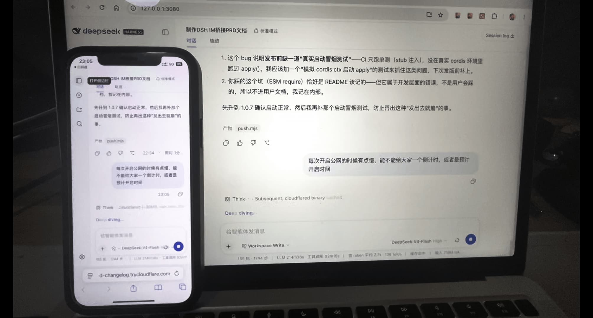
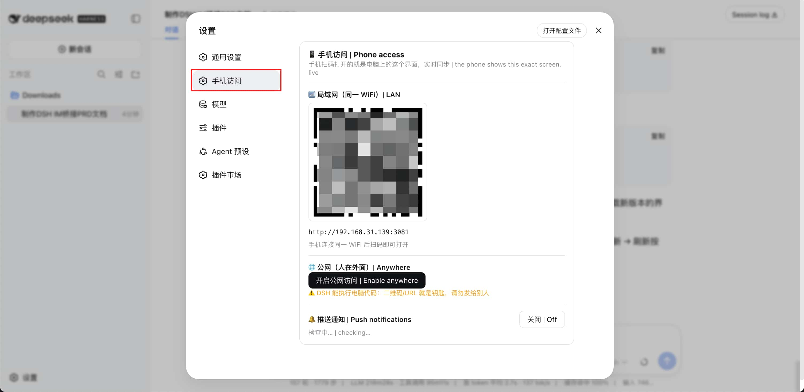

<p align="center">
  
</p>

<h1 align="center">DSH Pocket</h1>

<p align="center">[English](README.en.md) | [中文](README.md)</p>

<p align="center">
  <a href="https://www.npmjs.com/package/dsh-pocket"></a>
  <a href="https://www.npmjs.com/package/dsh-pocket"></a>
  <a href="https://github.com/shaobeichen/dsh-pocket/actions"></a>
  <a href="LICENSE"></a>
  <a href="https://github.com/shaobeichen/dsh-pocket/stargazers"></a>
</p>

> Put **DeepSeek Harness in your pocket**: one package, one settings tab — scan a QR code and your phone shows exactly what's on your computer screen, live, from anywhere.

## What is this

**You want to use DeepSeek Harness on your computer, even when you're not at the computer.**

- On your way home, the agent is running a task on your computer — pull out your phone and see where it is, what it produced.
- Out and about, you want the agent on your computer to look something up or write a snippet — no remote desktop, no SSH.
- The computer is at home or in the office, you're elsewhere, and you want to **drive your DeepSeek Harness from your phone** — send tasks, watch the output, tap approvals.

That's what DSH Pocket does: **install it, scan a QR code, and your phone shows and controls the DeepSeek Harness UI in real time — from anywhere.**

What it looks like — the phone shows the exact same UI as your computer, live:

<p align="center">
  
</p>

## ✨ Features

| Feature | Description |
|---|---|
| 📶 LAN QR access | Works out of the box: Settings → Plugins → Phone access — scan the LAN QR on the same Wi-Fi |
| 🌐 Public QR (from anywhere) | Click "Enable anywhere" → cloudflared tunnel → scan the public QR over 4G / any network |
| ⚡ Real-time sync | Streaming output passes through WebSocket untouched — what the computer renders, the phone renders live; fully interactive both ways |
| 📱 Mobile-adaptive layout | Narrow screens get a drawer layout automatically (ported from dsh-web-mobile, MIT): sidebar drawer, full-width conversation, safe-area insets, touch optimizations |
| 🧩 Zero-dependency install | One npm package, one settings tab — no core/adapter split, no account, no server |
| 🔒 URL is the key | No public URL exposure in LAN mode; public URL rotates on every restart |
| 🔔 Web Push | Phone notifications when a task finishes or fails (even with the page closed); requires the HTTPS public tunnel or localhost |

## 🚀 Usage

**Where the entry is**: after installing and restarting `dsh web`, open **Settings** — the left sidebar shows **"Phone access"** at the top level (same level as General / Models):

<p align="center">
  
</p>

**Prerequisite**: [DeepSeek Harness](https://github.com/deepseek-ai/deepseek-harness) installed. If your terminal says `dsh: command not found`, install it first:

```sh
npm install -g @deepseek-ai/dsh     # global install; verify: dsh --version
# No global install? Prefix every command with: npx @deepseek-ai/dsh
```

```sh
# 1. Install the plugin (everything in one package)
dsh plugin --profile web add dsh-pocket -w

# 2. Restart dsh web
npx @deepseek-ai/dsh web
```

### LAN (same Wi-Fi)

Settings → Plugins → **Phone access** → scan the "📶 LAN" QR code → the phone opens the exact same DSH, in real time.

### Public (from anywhere)

On the same page click "**Enable anywhere**" → wait for the tunnel (first run downloads cloudflared) → scan the "🌐 Public" QR code → works from outside (4G / office network).

> Upgrading: `dsh plugin --profile web update dsh-pocket --latest -w` (`--latest` is required across major versions — a `^0.x` range won't auto-jump to 1.x).

## ⚠️ Security (read first)

- **DSH can execute code on your computer.** The QR code / URL is the key — **never share it with anyone**.
- The public URL is randomly assigned by cloudflared and **changes on every restart** (old links die automatically — a natural key rotation).
- LAN mode exposes nothing publicly; only devices on the same network can reach it.
- Built for personal use; access tokens for multi-device/sharing are planned.

## 🩹 Troubleshooting (traps users step on)

| Symptom | Cause & fix |
|---|---|
| `dsh: command not found` / "DSH is not defined" | dsh CLI missing: `npm install -g @deepseek-ai/dsh`, or prefix commands with `npx @deepseek-ai/dsh` |
| `ERR_PNPM_ADDING_TO_ROOT` | pnpm 9 workspace-root restriction: append `-w` (`--workspace-root`) to install/update commands |
| Nothing changed after install/update | **You must restart `dsh web`**; the running process still loads the old code |
| `listen EADDRINUSE ... :3081` | A stale dsh-pocket process holds the port: `lsof -ti :3081 \| xargs kill -9`, then retry |
| Version stuck below 1.x | `^0.x` ranges never jump to 1.x: update with `--latest` (`dsh plugin --profile web update dsh-pocket --latest -w`) |
| No push on iOS Safari | Safari Web Push requires **"Add to Home Screen"** first, then open from the home-screen icon (Chrome/Android don't need this) |
| Public `error 1033` | See "Public tunnel troubleshooting" below — usually a local proxy/VPN (Clash etc. TUN mode) killing the tunnel |
| After "Restart dsh web", the page says the process is running in the background | The new process from in-page self-restart is a detached background process (not attached to your terminal) — that's the standard way to apply updates in-page; stop it with `lsof -ti :3080 \| xargs kill -9` (logs under `$DSH_HOME` as `dsh-pocket-restart-*.log`) |

## ⚠️ Public tunnel troubleshooting (read first)

**Symptom**: after clicking "Enable anywhere", the public URL shows `error 1033` (Tunnel error) on the phone.

**Most common cause: a local proxy/VPN (Clash, Surge, v2ray, sing-box, etc., especially in TUN mode).**
Such tools take over all traffic and often cut cloudflared's tunnel-edge connections
(`*.argotunnel.com`, Cloudflare edge IPs), so the tunnel registers but the data plane never connects.

**Fix (any one of)**:

1. Temporarily **fully quit the proxy** (not just close the window: quit Clash from the menu-bar icon; if a
   background service is installed, stop it in the service manager and confirm with `ps aux | grep clash`), then retry.
2. Add **DIRECT rules** to the proxy for the tunnel domains and Cloudflare edge (Clash example):
   ```yaml
   - DOMAIN-SUFFIX,argotunnel.com,DIRECT
   - DOMAIN-SUFFIX,trycloudflare.com,DIRECT
   - IP-CIDR,198.41.192.0/24,DIRECT,no-resolve
   ```
3. If the network really can't reach the tunnel, use **LAN mode**: turn on the phone hotspot → connect the computer to it → scan the LAN QR. Same experience, from anywhere.

**Other causes**: corporate firewalls / campus networks blocking outbound — ask IT to allow it, or use a hotspot.

## 🗂 Architecture (single package)

| File | Purpose |
|---|---|
| `lib/index.js` | Plugin entry: auto-start proxy + register RPC (`inject: connection, webServer`) |
| `lib/service.mjs` | Service: proxy lifecycle, public tunnel, status snapshot (with QR data URLs) |
| `lib/proxy.mjs` | Header-rewriting reverse proxy: Host/Origin → loopback, HTTP + WebSocket passthrough + polyfill injection |
| `lib/tunnel.mjs` | cloudflared quick tunnel: download/extract/start/parse public URL (HTTP/2) |
| `lib/web-rpc.js` | Loopback RPC: `pocket.status` / `tunnel.start` / `tunnel.stop` |
| `client/` | "Phone access" settings tab + mobile adaptation (dsh-web-mobile port) |
| `bin/dsh-pocket.mjs` | CLI: LAN/public modes, prints URL + QR |

## 🛠 Development

```sh
npm install
node client/build.mjs   # rebuild after editing client/
npm test                # proxy rewrite / WS passthrough / tunnel / service / RPC (7 tests)
```

## 🤝 Credits

- Mobile adaptation ported from [mexiaosqwq/dsh-web-mobile](https://github.com/mexiaosqwq/dsh-web-mobile) (MIT)
- Public tunnel powered by [cloudflared](https://github.com/cloudflare/cloudflared)

## 📄 License

[GPL-2.0](LICENSE) — copyleft: free to use, modify, and redistribute, but **derivatives must stay GPL** and keep the copyright notice; commercial use included.

> Note: the mobile-adaptation portion is ported from [dsh-web-mobile](https://github.com/mexiaosqwq/dsh-web-mobile) (MIT, GPL-compatible); its copyright notice stays in `client/mobile/LICENSE.dsh-web-mobile`.

---

**Questions? Feedback welcome**: bugs, ideas, or feature requests — open an issue at [GitHub Issues](https://github.com/shaobeichen/dsh-pocket/issues) 🙏
